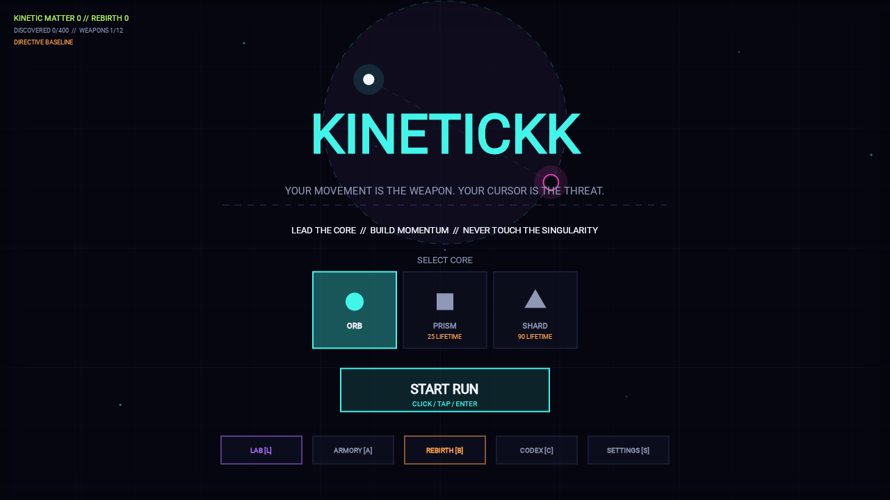

<!-- SPDX-FileCopyrightText: 2026 Vladislav Tomilov -->
<!-- SPDX-License-Identifier: GPL-3.0-or-later -->

<h1 align="center">KINETICKK</h1>

<p align="center">
  <strong>Your movement is the weapon. Your cursor is the threat.</strong>
</p>

<p align="center">
  A cross-platform physics-action roguelite powered by one Kotlin Multiplatform simulation.
</p>

<p align="center">
  
  
  
  <a href="LICENSE"></a>
</p>

<p align="center">
  <a href="#development">Development</a> ·
  <a href="#how-to-play">How to play</a> ·
  <a href="#systems">Systems</a> ·
  <a href="#contributing">Contributing</a> ·
  <a href="docs/project/LEGAL.md">Legal</a>
</p>



> [!IMPORTANT]
> KINETICKK is open-source software under the
> [GNU GPL version 3 or later](LICENSE). You may study, build, run, modify, and
> redistribute it. A distributed fork must keep the copyright and license
> notices, identify its changes, provide the complete corresponding source, and
> remain under the GPL. The KINETICKK name and branding are separate; see the
> [trademark policy](docs/project/TRADEMARKS.md).

The cursor or touch point is both a magnetic target and a lethal singularity. Pull it away from the Core to build speed, turn that momentum into impact damage, and never let the Core touch the singularity.

The same shared application composition, vertical features, gameplay simulation,
content catalogs, profile codec, and tests run across desktop (macOS, Windows,
and Linux) and modern browsers through WebAssembly.

The repository is published as a working learning example for Kotlin
Multiplatform, Compose Canvas rendering, deterministic simulation, progression
systems, and cross-platform persistence. You can inspect the design, build the
whole game locally, experiment with it, and contribute changes under the GPL.

## At a glance

| 400 items | 12 weapons | 40 Relics | 9 enemy archetypes | 7 vertical features |
|:---:|:---:|:---:|:---:|:---:|
| Deterministic catalog | Movement-reactive | Six aspects | Architect included | 26 leaf modules |

## How to play

Magnetic Polarity saturates when the target stays far away in one direction. A saturated tether stops adding thrust: turn decisively or bring the target inward to recover before enemies intercept your line.

| Input | Action |
|---|---|
| Mouse / touch drag | Move the singularity and attract the Core |
| `Space` / **Dash** | Kinetic Dash and phase through bullets |
| `Shift` / right mouse / **Brake** | Gravity Brake |
| `P` / `Esc` | Pause or return |
| `1`–`4` | Select an item, weapon, or Relic option |
| `Q` | Reroll an item or weapon choice |
| `L` / `A` / `B` / `C` / `S` | Lab, Armory, Rebirth, Codex, Settings |
| `M` | Toggle sound and music |
| `R` | Restart after a completed run |

Defeat **The Architect** on the current Rebirth tier to unlock the next one. Rebirth starts a fresh run build with a stronger threat profile while preserving permanent progression, unlocks, Codex discovery, and settings.

## Development

Requirements: JDK 17 or newer. The Gradle wrapper downloads the matching Gradle distribution automatically.

```bash
git clone https://github.com/4wl2d/KINETICKK.git
cd KINETICKK
./gradlew run
```

On Windows, use `gradlew.bat run`.

### Browser development

```bash
./gradlew wasmJsBrowserDevelopmentRun
```

Open the local URL printed by Gradle. A production WebAssembly bundle can be built with:

```bash
./gradlew wasmJsBrowserDistribution
```

The optimized bundle is written to `app/web/build/dist/wasmJs/productionExecutable`.

### Verification and packaging

| Goal | Command |
|---|---|
| Run desktop tests | `./gradlew desktopTest` |
| Build the production web bundle | `./gradlew wasmJsBrowserDistribution` |
| Verify architecture, tests, Wasm compilation, and the web bundle | `./gradlew verifyArchitecture desktopTest compileTestKotlinWasmJs wasmJsBrowserDistribution` |
| List every available task | `./gradlew tasks` |

## Systems

- **Kinetic combat:** fixed-step simulation at 120 Hz, uncapped magnetic acceleration, swept high-speed collisions, mass-based impact damage, recoil, Gravity Brake, and Polarity saturation.
- **Buildcraft:** twelve movement-reactive weapons, forty rankable Relics, four Sovereign Relics, four bound Relic slots, and 400 deterministic items across twenty modifier families.
- **Run progression:** Data leveling, stat evolutions, Elite Keys, two-stage Totems, weapon mastery, combo rewards, velocity tiers, Kinetic Overdrive, and a twenty-minute Architect finale.
- **Persistent progression:** spendable Kinetic Matter, eight Lab upgrades, twelve Armory unlocks, three Core shapes, Codex discovery, and replayable Rebirth threat tiers.
- **Presentation:** infinite procedural grid, camera tracking, trails, particles, screen shake, configurable damage numbers, and procedural synth audio on desktop and web.
- **Opposition:** Drifter, Shooter, Charger, Interceptor, Weaver, Warden, Splitter, Elite, and Architect behaviors with projectiles and escalating wave mixes.

## Project layout

| Path | Responsibility |
|---|---|
| `app/shared` | Application composition root: navigation, back stack, global shortcuts, audio lifecycle, and preservation of the active gameplay session beneath overlay features |
| `app/desktop` | Thin JVM/desktop host and native packaging; depends only on `app/shared` |
| `app/web` | Thin Wasm browser host and production web bundle; depends only on `app/shared` |
| `core/common` | Small platform-independent collection and random utilities |
| `core/content` | Shared persistent IDs, definitions, and content catalogs |
| `core/design-system` | Canvas tokens, text, geometry, and reusable UI primitives |
| `core/profile/api`, `core/profile/data` | Immutable profile slices and narrow capability contracts; atomic v2/v3 codec and platform storage |
| `core/audio/api`, `core/audio/impl` | Audio contract and Desktop/Wasm implementations |
| `feature/home/api`, `feature/home/impl` | Home route, render model, outputs, reducer, renderer, and input mapping |
| `feature/gameplay/api`, `feature/gameplay/domain`, `feature/gameplay/presentation`, `feature/gameplay/impl` | Live-run configuration and outputs, simulation and run state, Canvas presentation and input mapping, and Compose orchestration |
| `feature/settings/api`, `feature/settings/impl` | Persisted player preferences and local page state |
| `feature/lab/api`, `feature/lab/impl` | Permanent meta-upgrade purchases |
| `feature/armory/api`, `feature/armory/impl` | Weapon unlocks, loadout selection, and local pagination |
| `feature/rebirth/api`, `feature/rebirth/impl` | Two-step Rebirth confirmation and cycle advancement |
| `feature/codex/api`, `feature/codex/impl` | Collection browsing, local pagination, and a read-only snapshot of current run stacks |
| `build-logic` | Gradle conventions plus `verifyArchitecture` dependency-boundary enforcement |

Each feature API exposes a Compose entry point, a small immutable render model,
and feature-specific output events. Its implementation owns the corresponding
actions, reducer, renderer, and input mapping. Features never navigate to one
another directly: `app/shared` handles their outputs and supplies narrow core
capabilities or snapshots. The build rejects `impl → impl`, `core → feature`,
`feature → app`, and cross-feature dependencies. The root project contains no
production sources.

## Contributing

Bug reports, ideas, tests, documentation, and pull requests are welcome. Read
[the contribution guide](docs/project/CONTRIBUTING.md) before submitting code.

Every commit in a pull request must include a Developer Certificate of Origin
sign-off. Before a copyrightable contribution is merged, its author must also
sign the [KINETICKK Contributor License Agreement](docs/project/CONTRIBUTOR_LICENSE_AGREEMENT.md).
The CLA keeps the public contribution under GPL and lets the project owner
prepare store builds without taking away the contributor's right to use their
own work.

## Status

KINETICKK is a playable `0.1.0` prototype. APIs, balance, content, and saved-progress formats may change while the game is in active development.

## License

Copyright © 2026 Vladislav Tomilov.

KINETICKK's original code, tests, docs, game content, and project-made assets are
free and open-source under the **GNU General Public License version 3 or later**.
The GPL permits use, modification, redistribution, and commercial distribution.
When you distribute the game or a fork, you must follow the GPL's notice,
source-code, and copyleft terms.

The GPL does not grant rights to present a fork as the official KINETICKK game
or to imply endorsement by Vladislav Tomilov.

- [GNU GPL version 3 or later](LICENSE)
- [Legal overview](docs/project/LEGAL.md)
- [Copyright and open-source notice](NOTICE)
- [Authorship record](docs/project/AUTHORS.md)
- [Trademark and brand policy](docs/project/TRADEMARKS.md)
- [Third-party notices](docs/project/THIRD_PARTY_NOTICES.md)
- [Contribution policy](docs/project/CONTRIBUTING.md)
- [Contributor License Agreement](docs/project/CONTRIBUTOR_LICENSE_AGREEMENT.md)
- [Project governance](docs/project/GOVERNANCE.md)
- [Corresponding source plan](docs/project/SOURCE.md)
- [Asset provenance](docs/project/ASSET_PROVENANCE.md)
- [Privacy note for prototype 0.1.0](docs/project/PRIVACY.md)
