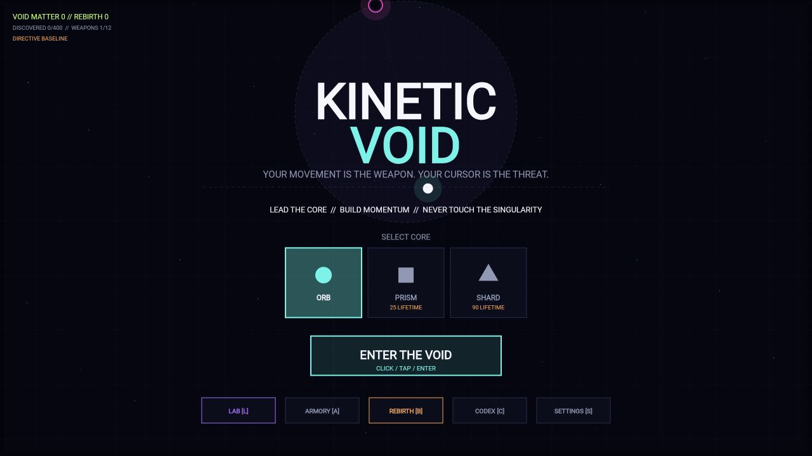

<h1 align="center">Kinetic Void</h1>

<p align="center">
  <strong>Your movement is the weapon. Your cursor is the threat.</strong>
</p>

<p align="center">
  A cross-platform physics-action roguelite powered by one Kotlin Multiplatform simulation.
</p>

<p align="center">
  
  
  
  <a href="LICENSE"></a>
</p>

<p align="center">
  <a href="#quick-start">Quick start</a> ·
  <a href="#how-to-play">How to play</a> ·
  <a href="#systems">Systems</a> ·
  <a href="docs/ARCHITECTURE.md">Architecture</a>
</p>



The cursor or touch point is both a magnetic target and a lethal singularity. Pull it away from the Core to build speed, turn that momentum into impact damage, and never let the Core touch the void.

The same shared engine, renderer, content catalog, progression system, and tests run across desktop (macOS, Windows, and Linux) and modern browsers through WebAssembly.

## At a glance

| 400 items | 12 weapons | 40 Void Relics | 9 enemy archetypes | 92 desktop tests |
|:---:|:---:|:---:|:---:|:---:|
| Deterministic catalog | Movement-reactive | Six aspects | Architect included | Seeded simulation |

## How to play

Magnetic Polarity saturates when the target stays far away in one direction. A saturated tether stops adding thrust: turn decisively or bring the target inward to recover before enemies intercept your line.

| Input | Action |
|---|---|
| Mouse / touch drag | Move the singularity and attract the Core |
| `Space` / **Dash** | Void Dash and phase through bullets |
| `Shift` / right mouse / **Brake** | Gravity Brake |
| `P` / `Esc` | Pause or return |
| `1`–`4` | Select an item, weapon, or Relic option |
| `Q` | Reroll an item or weapon choice |
| `L` / `A` / `B` / `C` / `S` | Lab, Armory, Rebirth, Codex, Settings |
| `M` | Toggle sound and music |
| `R` | Restart after a completed run |

Defeat **The Architect** on the current Rebirth tier to unlock the next one. Rebirth starts a fresh run build with a stronger threat profile while preserving permanent progression, unlocks, Codex discovery, and settings.

## Quick start

Requirements: Git and JDK 17 or newer. The Gradle wrapper downloads the matching Gradle distribution automatically.

```bash
git clone https://github.com/4wl2d/KINETICKK.git
cd KINETICKK
./gradlew run
```

On Windows, use `gradlew.bat run`.

### Browser development

```bash
./gradlew wasmJsBrowserDevelopmentRun
```

Open the local URL printed by Gradle. A production WebAssembly bundle can be built with:

```bash
./gradlew wasmJsBrowserDistribution
```

The optimized bundle is written to `build/dist/wasmJs/productionExecutable`.

### Verification and packaging

| Goal | Command |
|---|---|
| Run desktop tests | `./gradlew desktopTest` |
| Build the production web bundle | `./gradlew wasmJsBrowserDistribution` |
| Package for the current desktop OS | `./gradlew packageDistributionForCurrentOS` |
| List every available task | `./gradlew tasks` |

## Systems

- **Kinetic combat:** fixed-step simulation at 120 Hz, uncapped magnetic acceleration, swept high-speed collisions, mass-based impact damage, recoil, Gravity Brake, and Polarity saturation.
- **Buildcraft:** twelve movement-reactive weapons, forty rankable Void Relics, four Sovereign Relics, four bound Relic slots, and 400 deterministic items across twenty modifier families.
- **Run progression:** Data leveling, stat evolutions, Elite Keys, two-stage Totems, weapon mastery, combo rewards, velocity tiers, Kinetic Overdrive, and a twenty-minute Architect finale.
- **Persistent progression:** spendable Void Matter, eight Lab upgrades, twelve Armory unlocks, three Core shapes, Codex discovery, and replayable Rebirth threat tiers.
- **Presentation:** infinite procedural grid, camera tracking, trails, particles, screen shake, configurable damage numbers, and procedural synth audio on desktop and web.
- **Opposition:** Drifter, Shooter, Charger, Interceptor, Weaver, Warden, Splitter, Elite, and Architect behaviors with projectiles and escalating wave mixes.

## Project layout

| Path | Responsibility |
|---|---|
| `src/commonMain` | Shared simulation, input orchestration, content, audio logic, Canvas UI, and rendering |
| `src/desktopMain` | Desktop window, JVM persistence, and platform tone output |
| `src/wasmJsMain` | Browser entry point, WebAssembly host page, `localStorage`, and web audio |
| `src/commonTest` | Deterministic engine, catalog, progression, Relic, audio, and math tests |

See [Architecture](docs/ARCHITECTURE.md) for the runtime flow, platform boundaries, and testing model.

## Status

Kinetic Void is a playable `0.1.0` prototype. APIs, balance, content, and saved-progress formats may change while the game is in active development.

## License

Copyright © 2026 Vladislav Tomilov. All rights reserved. This source is publicly visible but remains proprietary; see the [KINETICKK Proprietary License](LICENSE). Contributions require a separate written intellectual-property assignment agreement.
