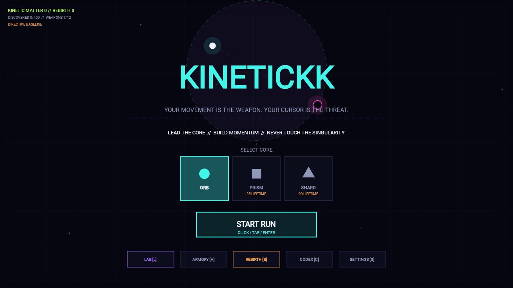

<!-- SPDX-FileCopyrightText: 2026 Vladislav Tomilov -->
<!-- SPDX-License-Identifier: GPL-3.0-or-later -->

# KINETICKK

**Your movement is the weapon. Your cursor is the threat.**

A physics-action roguelite for Android, desktop (macOS, Windows, Linux), and
WebAssembly, built with Kotlin Multiplatform and Compose.



Steer a magnetic singularity to accelerate your Core and turn momentum into
impact damage. Keep the Core away from the singularity, build a loadout, and
survive twelve minutes to face **The Architect**.

## How to play

Pull the cursor away from the Core to gain speed. Staying at the screen edges
drains Magnetic Polarity; return inward, turn, or brake to recover. Fresh
profiles start at 1× speed. Pauses and reward choices stop the run clock.

| Input | Action |
|---|---|
| Mouse / touch drag | Move the singularity and attract the Core |
| `Space` / **Dash** | Kinetic Dash and phase through bullets |
| `Shift` / right mouse / **Brake** | Gravity Brake |
| `P` / `Esc` | Pause or return |
| `1`–`4` | Select a reward |
| `Q` | Reroll an item or weapon choice |
| `L` / `A` / `B` / `C` or `I` / `S` | Lab, Armory, Rebirth, Codex, Settings |
| `M` | Toggle sound and music |
| `F3` | Toggle and reset the performance HUD |
| `R` | Restart after a completed run |

Six characters share permanent upgrades and can use all twelve weapons.
Builds combine 400 items, forty Relics, synergies, and optional anomaly trials.
Spend Kinetic Matter in the Lab and Armory between runs. Defeat The Architect
to unlock the next Rebirth tier while keeping permanent progression.

## Build and run

Requires JDK 17 or newer; Android builds also need the Android SDK.
The Gradle wrapper downloads Gradle and the project dependencies.
On Windows, replace `./gradlew` with `gradlew.bat`.

```bash
./gradlew :app:desktop:run
./gradlew :app:web:wasmJsBrowserDevelopmentRun
./gradlew :app:android:assembleDebug
```

The Android debug APK is in `app/android/build/outputs/apk/debug/` and uses a
separate package from the release. Build the production web bundle with
`./gradlew :app:web:wasmJsBrowserDistribution`; its output is
`app/web/build/dist/wasmJs/productionExecutable/`.

### Verification

```bash
./gradlew desktopTest
./gradlew :app:android:assembleDebug :app:android:assembleDebugAndroidTest :app:shared:assembleAndroidDeviceTest
CHROME_BIN=/path/to/chrome ./gradlew wasmJsBrowserTest wasmJsBrowserDistribution --max-workers=1
```

Architecture checks require a clean Pokeball checkout at
`b4a8219ecb70ae5e81214edd6b509b61d9db0637`:

```bash
./gradlew verifyArchitecture verifyPokeballArchitecture verifyPokeballConformance -PpokeballSnapshotDir=/path/to/pinned/Pokeball
```

[CI](.github/workflows/ci.yml) defines the complete platform checks.
[Performance tools](tools/performance/README.md) cover benchmark comparisons.
Project-specific architecture inputs live in
[docs/architecture/pokeball](docs/architecture/pokeball/README.md);
agent instructions are in [AGENTS.md](AGENTS.md).

### Crash reports

Desktop reports stay in `~/.kinetickk/crashes/`
(`%USERPROFILE%\.kinetickk\crashes` on Windows). The crash dialog can open
that folder; `bash tools/crashes/latest.sh --path` prints the latest report path.
Reports include logs, runtime details, and diagnostic copies of saves. Nothing
is uploaded. See the [privacy note](docs/project/PRIVACY.md).

## Status

Version **0.2.0** is a playable prototype. Before 1.0.0, only the current
profile schema is supported: incompatible profiles start from defaults, and
older save locations remain untouched. Balance, content, and save formats may
change during development.

## Contributing

Bug reports and focused pull requests are welcome. Describe the change and the
checks you ran; include comparable performance results for hot-path changes.
Follow the existing code and retain regression tests. Identify the source and
license of copied, generated, or adapted material. New project-authored files
use an accurate SPDX copyright line and `GPL-3.0-or-later` license identifier.

Contributions use GPL-3.0-or-later. Contributors keep their copyright and must
have the right to submit the material. No separate CLA or DCO sign-off is required.

## License

Copyright © 2026 Vladislav Tomilov. Licensed under
[GNU GPL version 3 or later](LICENSE). See [NOTICE](NOTICE),
[authors](docs/project/AUTHORS.md),
[third-party notices](docs/project/THIRD_PARTY_NOTICES.md),
[asset provenance](docs/project/ASSET_PROVENANCE.md), and
[corresponding source](docs/project/SOURCE.md).
The KINETICKK name and branding have a separate
[trademark policy](docs/project/TRADEMARKS.md).
