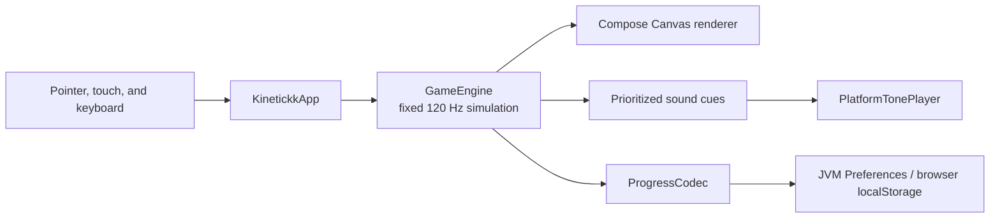

# KINETICKK architecture

KINETICKK keeps gameplay, rendering, content, progression, and most audio decisions in shared Kotlin code. Thin platform source sets provide the desktop window, browser host, persistent storage, and tone output.

## Runtime flow



`KinetickkApp` owns one remembered `GameEngine`, translates keyboard and pointer events into engine commands, advances the engine once per display frame, drains sound cues, and asks the shared Canvas renderer to draw the latest state.

## Source-set boundaries

| Source set | Main responsibilities |
|---|---|
| `commonMain` | Simulation, game state, content catalogs, progression, settings, input routing, audio sequencing, Canvas rendering, and shared math |
| `desktopMain` | Compose desktop `Window`, JVM `Preferences` persistence, and JVM tone playback |
| `wasmJsMain` | `ComposeViewport`, browser host page, `localStorage` persistence, and browser tone playback |
| `commonTest` | Seeded simulation tests and catalog, progression, combat, Relic, audio, and math coverage |

The platform boundary is deliberately small. `MetaStorage` and `PlatformTonePlayer` use Kotlin `expect`/`actual`; all other gameplay behavior stays shared.

## Simulation

`GameEngine.update` converts frame time into a bounded accumulator and advances gameplay in `1 / 120` second steps. A maximum step count prevents a stalled frame from creating an unbounded catch-up loop. Paused, menu, choice, and overlay states stop the simulation without discarding persistent progression.

The engine owns:

- Core motion, magnetic acceleration, braking, dash heat, and Polarity saturation
- Enemy steering, projectiles, pickups, collision resolution, and wave escalation
- Weapons, items, Relics, Totems, mastery, Rebirth, and permanent upgrades
- Camera state, trails, particles, screen effects, HUD state, and sound cues

Gameplay and visual randomness use separate seeded generators. This keeps gameplay tests reproducible while allowing cosmetic effects to evolve independently.

## Rendering and input

The UI is a single responsive Compose `Canvas`. `drawKinetickk` renders the procedural background, world, HUD, menus, choices, and overlays directly from `GameEngine` state.

Desktop and browser entry points both call the same `KinetickkApp`. Mouse, touch, right-click, keyboard, and on-screen controls converge on the same engine commands, so platform behavior does not fork at the gameplay layer.

## Persistence and audio

`ProgressCodec` serializes permanent progression and settings into one shared text representation.

- Desktop stores it under the JVM user `Preferences` node `kinetickk/progression`.
- WebAssembly stores it in browser `localStorage` under `kinetickk_progress_v2`.

The engine emits semantic `SoundCue` values. Shared audio logic prioritizes and limits cues per frame, then the platform player synthesizes tones with native JVM or browser audio APIs.

## Verification

The desktop target currently runs 92 deterministic tests across 11 common test files. They cover fixed-step motion, collision behavior, content invariants, Relic interactions, progression encoding, Rebirth, enemy and Totem systems, audio prioritization, and shared math.

```bash
./gradlew desktopTest
./gradlew wasmJsBrowserDistribution
```

These two commands verify the shared test suite on the JVM and compile the production WebAssembly application.
