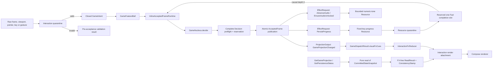

<!-- SPDX-FileCopyrightText: 2026 Vladislav Tomilov -->
<!-- SPDX-License-Identifier: GPL-3.0-or-later -->

# KINETICKK architecture

> **Status:** the Pokeball rewrite structure and protocol are implemented and
> locally verified on `agent/pokeball-architecture-rewrite`. The final desktop
> suite passed 150/150, Wasm test sources compiled, and full desktop/Wasm
> assembly plus browser distribution passed. The formal release-gate record
> remains evidence-bounded because the target is an uncommitted working tree and
> `RG-09` retains the state-byte-meter qualification.

KINETICKK has one singleton local `Game` Feature Ball. Run simulation, combat,
reward selection, progression, settings, semantic screen state, and latest
progress-persistence status share invariants, one `StateKey`, and one fixed-step
order. Splitting them by screen or subsystem would create competing writers
without an independent lifecycle or recovery boundary.

The accepted project decisions are in
[`pokeball-project-overlay.md`](pokeball-project-overlay.md). The canonical
architecture is [`../spec/pokeball-architecture-core.md`](../spec/pokeball-architecture-core.md),
and the declarative Game contract is
[`../architecture/game/ball.yaml`](../architecture/game/ball.yaml).

## Runtime flow



The runtime is caller-confined and runs one mutation to completion. Before an
accepted `PersistProgress` source decision, preflight reserves both total causal
depth and the single fixed completion slot. Publication of the complete state
and output batch precedes every output callback. A synchronous progress result
is quarantined, retained in that slot, and submitted as the next causal Fact;
it is cleared only after the Fact's own Decision commits. A failed completion is
reported as `GameContinuationStatus.Retained`; resume keeps the same causal
scope, and a new root is rejected with `AdmissionFailure.CausalBudgetExceeded`
while that slot remains occupied. Reentrant mutation is a typed admission
rejection.

The Ball runtime owns no mailbox, worker, coroutine, clock, ambient random
source, or service registry. The desktop audio Resource has a separately
declared worker/queue policy; that Resource mechanism is not an Inline Ball
execution profile.

## Boundary and authority

| Concern | Owner/state kind | Rule |
|---|---|---|
| Run phase, simulation, gameplay entities, timers, reward queues, settings, unlocks, matter, progress status, and gameplay RNG | `Game` / Sovereign | One Inline writer for `kinetickk.local/Game/local-player` |
| Validated bootstrap progress | Assembly / Captured Input | Provider/byte/codec quarantine plus a second finite-value/domain-cap normalization before revision 0; the raw text/object is discarded |
| Canonical `GameProjection` and `PersistenceStatus` results | Projection | Structurally immutable payloads derived only from the committed Game snapshot; no command authority, platform object, or Interaction FX crosses the stamped read boundary |
| Pointer gesture edge, focus, text measurement, interpolation clock | Interaction / Ephemeral | Loss does not change a Game decision |
| Particles, motion echoes, shockwaves, damage numbers, decorative arcs, visual RNG | `InteractionFxReducer` / Ephemeral | Finite and drop-eligible; never read by the Nucleus |
| Enemies, projectiles, pickups, gameplay trail, weapon nodes/orbitals, Totem | `Game` / Sovereign | Retained because later gameplay decisions consume them |

`GameProjectionChanged` carries an immutable bounded visual-cue batch after a
Game commit. `GameDispatchResult.Committed` returns that batch separately from
the canonical `ReadResult`. Static `GameAssembly` owns the separately seeded
`InteractionFxReducer`, which alone evolves the visual
collections using its own explicit-seed RNG, and Interaction attaches its
structurally immutable `VisualFxProjection` only for rendering. The canonical
`GameProjection` type has no FX fields; therefore its `ConsistencyStamp` covers
the entire Query payload and covers no Interaction state. The render attachment
is explicitly unstamped, ephemeral, and outside durability/lossless-delivery
claims.

There is no Flow Ball, Read Model Ball, second mutable gameplay model, hidden
global locator, or inter-Ball route.

## Closed protocol 1.0.0

### Ingress and reads

The complete Intent set is:

```text
FrameElapsed, ViewportChanged, PointerMoved, PointerPressed, PointerReleased,
BrakeChanged, DashRequested, PauseToggled, EscapeRequested, ScreenOpenRequested,
MuteToggled, ChoiceSelected, ChoicesRerolled, EnterPressed, RunStartRequested,
ReturnToMenuRequested, RebirthRequested, CoreShapeSelected,
MetaUpgradePurchaseRequested, WeaponPurchaseOrEquipRequested,
UserGestureObserved
```

Raw frame, viewport, and pointer numbers become Intents only through
`GameInteractionValidator`; unknown/non-finite/out-of-range values produce a
pre-acceptance validation result. The Nucleus retains a second typed invariant
check, but it is not the raw-ingress parser.

Both Query mappings are exact:

| Query | Result payload | Response |
|---|---|---|
| `GetGameProjection` | FX-free `GameProjection` from the committed Game snapshot | `ReadResult<GameProjection>` |
| `GetPersistenceStatus` | `PersistenceStatus` | `ReadResult<PersistenceStatus>` |

The read boundary receives `CommittedStateSnapshot` and `ReadContext`. A
successful result copies `ballInstanceId`, `commitRevision`, and
`stateSchemaVersion` into `ConsistencyStamp`. A Query creates no Decision,
revision, `SemanticHandle`, `sourceOrdinal`, or `SemanticOutput`.

### Decisions and outputs

The Nucleus returns exactly `Accepted(Decision)` or
`Rejected(BusinessRejection)`. An accepted Decision contains a private state
candidate and a defensively copied immutable output batch. The only canonical
semantic-output envelopes used by protocol 1.0.0 are:

| Envelope | Payload |
|---|---|
| `ProjectionOutput` | `GameProjectionChanged(visualFxCues)` |
| `EffectRequest` | `AdvanceAudio`, `EnsureAudioUnlocked`, `PersistProgress` |

Each envelope contains
`SemanticHandle(operationId, outputKind, localOrdinalOrName)` and one unique
zero-based `sourceOrdinal` covering `0..outputs.size-1`. `OperationId` is
reserved before `decide` and supplied in `GameDecisionContext`; runtime
materialization identities are not decision inputs. The output builder emits
`GameProjectionChanged` first, then zero-to-two Effects, so the complete batch
never exceeds three envelopes.

Visual cue construction is itself bounded: the batch has 2048 positions, with
2047 retained cue positions and one position reserved for
`VisualCuesDropped(count)`. Synchronization-critical clear, advancement,
motion, and rebase cues first displace the oldest decorative cue. If a caller
bypasses normal one-Decision draining long enough to fill the batch with those
cues, the defensive fallback displaces the oldest visual cue instead of failing
gameplay. Every omitted/displaced cue is counted explicitly.

Progress Resource outcomes return only as `ProgressPersisted` or
`ProgressPersistenceOutcomeUnknown`. A Fact carries the exact accepted persist
handle, `PLATFORM_LOCAL` provider provenance, and, for unknown execution, a
closed typed reason. Mismatched provider/handle/context is rejected without
state or output. Replies, Signals, ControlPulses, Timers, Commands, and imported
contracts are empty for this version.

## Logical source organization

```text
src/commonMain/kotlin/kinetickk/
  application/
    assembly/          static Game and private Resource construction
    runtime/           generic Inline acceptance, preflight, and immutable frame
  features/game/
    GameFeatureBall.kt protocol boundary, completion owner, reads, dispatch
    interaction/
      validation/      raw platform input quarantine
      fx/              Interaction-owned visual reducer, RNG, and render attachment
      *.kt             Compose host and immutable renderers
    nucleus/
      domain/          private Game catalogs and value rules
      protocol/        closed version-1 Pulses and SemanticOutputs
      read/            canonical read values and stamp
      state/           cloned Game authority candidate
      transition/      pure Nucleus and output builder
      projection/      immutable render payload values
    resources/
      audio/           bounded numeric-tone capability
      progress/        fixed-provider/key codec and result quarantine
  foundation/
    collections/       defensive immutable containers
    random/            explicit-seed snapshot/copy PRNG mechanics
```

Platform source sets contain only thin application hosts and Resource actuals.
Content catalogs, progression, settings, and protocol values remain under the
Game feature; Foundation contains no shared domain authority.

## Profiles and Resource execution

| Dimension | Selected profile | Mechanism | Not guaranteed |
|---|---|---|---|
| Execution | `Inline` | Caller-confined run-to-completion, reentrancy guard, one pre-reserved completion slot | Ball mailbox/worker, concurrent fairness, parallel decisions |
| State | `Transient` | One atomically replaced in-memory `AcceptedFrame` | Crash durability, durable output/status, zero-RPO recovery |
| Isolation | `InProcess` | Explicit construction and source/dependency boundaries | Hostile-component containment |
| Security | `Standard` | Double Quarantine, scoped capabilities, safe exact-key/numeric sinks | General hardened security |
| Composition | `Static` | `GameAssembly` directly constructs the graph | Dynamic discovery or runtime service registry |

Resource execution is deliberately separate:

| Resource | Mechanism | Loss/status semantics |
|---|---|---|
| Desktop audio | One daemon worker, `ArrayBlockingQueue(24)`, `DiscardOldestPolicy` | Best-effort/drop-eligible audio only; no Fact/status |
| WebAssembly audio | Direct validated numeric Web Audio sink | Best-effort; no Ball worker/mailbox |
| Progress | Synchronous exact-key call, <=65536 UTF-8 bytes | One attempt; typed `Persisted` or `OutcomeUnknown`; no retry/durability claim |

Audio accepts at most 32 cues from one decision and selects at most three by a
declared priority policy. A progress exception after a possible write remains
`OutcomeUnknown`; it is not relabeled success or safe failure.

## Limits and validation boundary

The nine mandatory Game limits are `4096` input bytes, `16777216` state bytes,
`2048` items per collection, `3` outputs, `2` Effects, `0` Commands, causal
depth `2`, `0` retries, and `48` fixed simulation steps. The game retains its
120 Hz step and domain caps recorded in the manifest. Non-drop-eligible overflow
must reject or backpressure the complete candidate before acceptance; it does
not authorize a partially accepted frame. The declared decorative visual/audio
policies are the narrow exceptions: their loss is best-effort, bounded, and
cannot affect Game authority.

Implementation evidence is named in
[`pokeball-conformance.md`](pokeball-conformance.md). In particular:

- `InlineAcceptedFrameRuntimeTest` covers immutable batches, atomic publication,
  reentrancy, and generic exact `N/N+1` meters.
- `GameFeatureBallArchitectureTest` covers deterministic traces, stamped reads,
  commit-before-Resource dispatch, exact persistence causality, and mandatory
  plus domain-specific Game caps.
- `GameInteractionValidationTest` covers raw numeric ingress boundaries.
- `InteractionFxReducerTest` covers deterministic visual evolution and exact
  visual collection caps.
- `BoundedVisualFxCueAccumulatorTest` covers the 2048-cue boundary,
  synchronization-cue retention, reset-on-drain, and explicit visual-drop metadata.
- `ProgressStoreTest`, `ProgressCodecTest`, `GameAssemblyTest`, `GameAudioTest`, and
  `DesktopAudioExecutionPolicyTest` cover Resource quarantines and policies.
- `ImmutableCollectionsTest` and `CloneableXorWowRandomTest` cover the two
  mechanical Foundation exports.

These evidence sources passed in the recorded integrated local run. That result
does not widen the selected profiles or turn a partial formal release gate into
a project-wide conformance claim.

## Migration and verification

The pre-rewrite `GameEngine`/direct-render tree is a behavior baseline, not a
current architectural boundary. Its mapping and compatibility requirements are
in [`pokeball-migration.md`](pokeball-migration.md); the mechanical-only export
review is in [`pokeball-foundation-scan.md`](pokeball-foundation-scan.md).

The final verification set is:

```bash
./gradlew assemble
./gradlew desktopTest --rerun-tasks
./gradlew wasmJsTestClasses --rerun-tasks
./gradlew wasmJsBrowserDistribution
```

Browser execution is environment-dependent and is recorded separately from
source compilation and distribution assembly. On the recorded machine,
`wasmJsBrowserTest` compiled the test executable but could not launch
ChromeHeadless because the Chrome binary/`CHROME_BIN` was unavailable.
